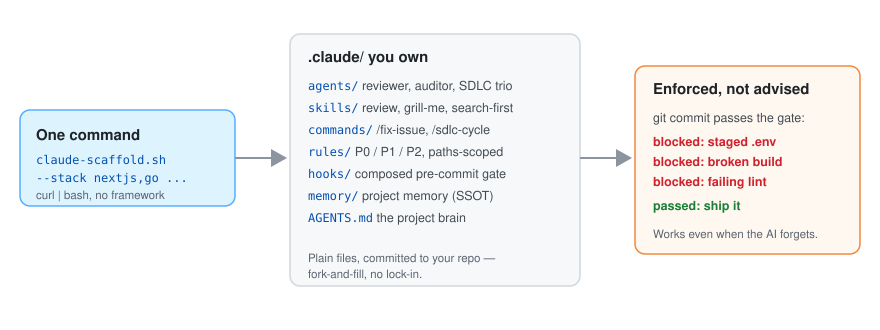

# claude-scaffold

한국어 | [English](README.en.md)

[](https://github.com/leeyudok/claude-scaffold/actions/workflows/test.yml)
[](LICENSE)

**프레임워크가 아니라 fork-and-fill 미니멀 부트스트랩** — Claude Code 용 `.claude/` 초기
구성에 **강제되는** 규칙 티어 P0(즉시 중단)/P1(PR 차단)/P2(리뷰 지적)를 얹고, 스택
프리셋을 pre-commit 게이트 하나로 합성한다.


_30초 데모: 명령 한 번 → `.claude/` 완성 → 시크릿 커밋은 게이트가 차단. 재현은 `vhs docs/assets/demo.tape`._

## 퀵스타트

```bash
# clone 없이 원커맨드
curl -fsSL https://raw.githubusercontent.com/leeyudok/claude-scaffold/main/bin/claude-scaffold.sh | bash -s -- --stack nextjs --yes

# 또는 로컬 clone 에서 (옵션 생략 시 대화형 프롬프트)
git clone https://github.com/leeyudok/claude-scaffold.git
claude-scaffold/bin/claude-scaffold.sh /path/to/new-repo --forge github --stack nextjs,bun --name my-app
```

결과물은 채워진 `.claude/` 디렉터리(agents·skills·hooks·paths 스코프 rules·memory),
`AGENTS.md` 프로젝트 브레인, 합성된 pre-commit 게이트 하나 — 전부 직접 소유하는 평범한
파일이다. 전체 옵션은 [사용법](#사용법-1--스크립트) 참조.

## 무엇을 얻나 — 입문자 기준

<picture>
  <source media="(prefers-color-scheme: dark)" srcset="docs/assets/overview-dark.svg">
  
</picture>

설치 1분 뒤부터 Claude 가 "규칙을 아는 팀원"처럼 움직인다. 프롬프트를 잘 몰라도:

- **워크플로가 기본값**: "로그인 기능 만들어줘" 한 마디에 이슈 등록 → 브랜치 → 구현 →
  테스트 동반 → PR/MR 까지 스스로 따른다 (`/fix-issue`, `/sdlc-cycle` 은 역할 분리
  에이전트 3개가 무인 사이클).
- **실수는 기계가 차단**: `.env`/시크릿 커밋, 타입에러·빌드 깨진 커밋, 신규 JSP
  스크립틀릿은 pre-commit 훅이 막고, 복잡도 15 초과 함수는 경고한다 — Claude 가
  깜빡해도 걸리는 강제 게이트.
- **명령 한 방 시리즈**: `/review`(코드리뷰+보안감사 이중), `/status`,
  `/knowledge-graph`(문서 링크 검사), `/sonar`.
- **요구사항 다지기는 둘 중 골라서**: 스펙을 다회전으로 압박 검증하는 **`grill-me`**(동봉),
  아이디어를 함께 발산·수렴하는 **superpowers 의 `brainstorming`**(별도 플러그인,
  [obra/superpowers](https://github.com/obra/superpowers)). 둘 다 설치돼 있으면 작업
  성격대로 작업마다 택일하면 된다 — 이미 방향이 선 기능은 grill-me 로 굽고, 백지
  아이디어는 brainstorming 으로 넓힌다.
- **세션이 끝나도 기억**: `.claude/memory/` 에 프로젝트 러닝이 쌓여 다음 세션에 자동
  로드되고 팀과 공유된다.
- **스스로 진화**: skill-evolve/agent-evolve 가 실패 피드백으로 스킬·에이전트 정의를
  직접 고친다 — 쓸수록 프로젝트에 맞게 좋아진다.
- **팀/멀티세션 안전**: 세션마다 git worktree 격리 규칙이 기본이라 병렬 작업이 서로를
  덮어쓰지 않는다.

## 왜 claude-scaffold 인가

대형 설치형 프레임워크나 에이전트/스킬 카탈로그와 달리, claude-scaffold 은 런타임도 플러그인
시스템도 동기화할 중앙 레지스트리도 없다 — `.claude/` 디렉터리 골격 + 스택 프리셋 몇 개를
레포에 한 번 복사하면 그걸로 끝이고, 이후 업그레이드할 대상 자체가 없다. fork 해서
placeholder 를 채우고 안 쓰는 걸 지우면, 결과는 레포의 다른 코드와 똑같이 버전 관리되는
평범한 파일들이다.

- **선언이 아니라 강제** — P0/P1/P2 티어가 훅(pre-commit 게이트·deny 규칙·CC 경고)에
  물려 있다. 문서에만 적힌 규칙이 아님.
- **paths 스코프 룰** — 매칭 파일을 만질 때만 룰이 로드돼 컨텍스트가 가볍다.
- **자기개선** — `skill-evolve`/`agent-evolve` 가 실수에서 "Learned warnings" 를
  스킬/에이전트에 축적한다.
- **테스트됨** — 부트스트랩 스크립트는 bats 회귀 스위트, 문서는 지식그래프 링크 체커가
  게이트한다.

## 무엇이 들어있나

```
.claude/
  agents/
    security-audit.md   12-item P0/P1 보안 그레프 스캔
    db-migration.md     DDL 안전성 검증 + 롤백 SQL 생성
    sdlc-developer.md   최소 범위 구현 에이전트 (SDLC 역할 분리)
    sdlc-tester.md      AC/TC 테스트 작성 에이전트
    sdlc-verifier.md    파이프라인 실행·리포트 에이전트
    agent-evolve.md     자기개선 메타 에이전트 — 실행 피드백으로 agents/*.md 자동 개선
  commands/
    sonar.md            SonarQube 분석 (CE task 폴링, sqp_/squ_ 구분)
    sdlc-cycle.md       5단계 SDLC 자동화
    knowledge-graph.md  .claude 지식 그래프 재생성 + 깨진 링크 체크
  hooks/
    pre-commit.sh       pre-commit 게이트 골격 (스택 partial 진입점)
    post-edit-format.sh PostToolUse(Edit|Write) → 자동 포맷
    post-test-notify.sh PostToolUse(Bash, *test*) → 터미널 알림
    stop-memory-remind.sh Stop hook → 세션-once 메모리 리마인드
    cc-check.py         PostToolUse(Bash, git commit) → CC > 15 경고
  memory/
    MEMORY.md           auto-memory 인덱스 (SSOT)
    README.md           메모리 타입·운용 규칙
  rules/
    common.md           P0/P1/P2 우선순위 체계 + 공통 워크플로 (항상 로드)
    security.md         시크릿/인증 P0 + 록아웃·관리자 주입 규칙 (paths 스코프)
    testing.md          기능당 1테스트, mock 단위 우선, 사용자 관점 어설션
    data.md             데이터 스크립트 규칙 — 대량 스테이징 금지, 인코딩 명시
    README.md           paths 스코프 로드 + 룰 작성 원칙
  skills/
    skill-evolve/       자기개선 메타 스킬 (Learned warnings 패턴)
    status/             멀티스택 상태 체크
    review/             code-reviewer + security-audit 래퍼
    memory-factcheck/   메모리 사실 검증 — 코드·DB·이슈 대조로 stale 정정
    security-precheck/  감사 대비 보안 사전점검 → 이슈 → 병렬 수정
  workflows/
    rules-audit.js      저장형 Workflow 예제 — 스캔/검증/수정, 머지는 사람 게이트
  scripts/
    knowledge_graph.py  .claude 생태계 그래프 + --check 깨진 링크 게이트
  settings.json         hooks 와이어링 + deny 기본값
AGENTS.md               프로젝트 브레인 — 규칙 SSOT (P0/P1/P2 + 워크플로)
CLAUDE.md               @AGENTS.md 포인터 (Claude Code)
GEMINI.md               @AGENTS.md 포인터 (Gemini CLI)
presets/                프리셋 조각 (복사 덮어쓰기 방식)
  forge-github/         GitHub forge — gh, PR, `Closes #N` 자동 클로즈
  forge-gitlab/         GitLab forge — glab, MR, `Closes #N` 자동 클로즈(머지 후 확인)
  nextjs/ bun/ ...      스택별 조각 (rules + pre-commit.partial.sh)
  lang-en/              영어 오버레이 (base/forge-*/stacks/*) — 아래 `--lang` 참조
bin/                    claude-scaffold.sh 부트스트랩 스크립트
```

## 스택 프리셋

| 프리셋 | 룰 파일 | pre-commit 게이트 |
|--------|---------|-----------------|
| `nextjs` | nextjs.md (paths: app/**, components/**) | `tsc --noEmit` |
| `springboot` | springboot.md (paths: src/main/java/**) | `./gradlew build` |
| `javaweb` | javaweb.md (paths: src/main/java/**, **/*.jsp) | maven/gradle/ant 컴파일 (자동 감지) |
| `bun` | bun.md (paths: **/*.ts) | `bunx tsc --noEmit` |
| `python` | python.md (paths: **/*.py) | `ruff check` + `mypy` |
| `go` | go.md (paths: **/*.go) | `go build ./...` + `vet` + `golangci-lint` |
| `rust` | rust.md (paths: src/**/*.rs, **/*.rs) | `cargo check` + `clippy` |
| `android` | android.md (paths: **/*.kt) | `./gradlew ktlintCheck detekt` |
| `ops` | ops.md (paths: Dockerfile, docker-compose*, quadlet/**, ansible/**) | — |

## Forge 프리셋 (`--forge`)

이슈/PR 워크플로를 forge 별로 주입한다. 스택 프리셋보다 먼저 머지된다.

| 프리셋 | CLI | PR/MR | 이슈 클로즈 |
|--------|-----|-------|------------|
| `github` (기본) | `gh` | PR | `Closes #N` 로 머지 시 **자동 클로즈** |
| `gitlab` | `glab` | MR | `Closes #N` 자동 클로즈 동작 — 머지 후 확인, `opened` 시만 수동 |

주입 파일: `.claude/rules/forge.md`(항상 로드) + `.claude/commands/fix-issue.md`·`sdlc-cycle.md`(forge 변형으로 덮어씀). 베이스 파일은 forge 중립("이슈/PR·MR").

## 언어 (`--lang`)

베이스 트리(agents·rules·skills·commands·`AGENTS.md`·훅/settings 메시지)는 **기본이
한국어다**(#36 반전 — 한국어가 원본, 영어는 번역 오버레이). `--lang en` 을 주면 영어
번역을 **가장 마지막에** 얹는다 — 베이스 복사 → forge 프리셋 → 스택 프리셋이 끝난 뒤
`presets/lang-en/base` + `presets/lang-en/forge-<forge>` + `presets/lang-en/stacks/<stack>`
콘텐츠로 동일 파일을 덮어쓴다.

```bash
claude-scaffold/bin/claude-scaffold.sh /path/to/new-repo --lang en --forge github --stack bun
```

`.claude/hooks/pre-commit.sh` 는 `--lang` 오버레이 대상이 아니다(스택 파셜이 삽입되는
파일이라 언어 단일본 — 코드 동작에는 영향 없음). `--update` 는 한국어 베이스만
갱신하므로, 영어 오버레이가 필요하면 `--lang en` 으로 다시 실행한다.

## 사용법 1 — 스크립트

```bash
git clone https://github.com/leeyudok/claude-scaffold.git
# --forge 기본값 github. GitLab 레포면 --forge gitlab
claude-scaffold/bin/claude-scaffold.sh /path/to/new-repo --forge github --stack nextjs,bun --name my-app
```

대화형으로 쓰려면 `--forge`/`--stack`/`--name` 생략 → 프롬프트가 묻는다(forge 기본 github).

### 옵션

| 옵션 | 설명 |
|---|---|
| `<target-dir>` | 대상 디렉터리. 기본 `.` |
| `--forge <forge>` | `github`(기본) 또는 `gitlab` |
| `--lang <lang>` | `ko`(기본) 또는 `en` |
| `--stack <목록>` | 쉼표구분 스택 프리셋. 미지정 시 대화형 프롬프트 |
| `--name <name>` | `{{PROJECT_NAME}}` 치환값. 기본 = 대상 디렉터리명 |
| `--yes` | 대화형 프롬프트 생략(비대화 모드) |
| `--update` | 이미 부트스트랩된 프로젝트의 베이스 파일 최신화 (아래 참조) |

### 원격 원커맨드 설치 (clone 불필요)

```bash
curl -fsSL https://raw.githubusercontent.com/leeyudok/claude-scaffold/main/bin/claude-scaffold.sh | bash -s -- --stack nextjs --yes
```

로컬에 레포가 없는 상태(파이프 실행)로 감지되면 `CLAUDE_SCAFFOLD_REPO`(기본
`github.com/leeyudok/claude-scaffold`, env 로 오버라이드) tarball 을 임시 디렉터리에 받아 템플릿 소스로 쓴다. 브랜치/태그 지정은
`CLAUDE_SCAFFOLD_REF`(기본 `main`) 로 오버라이드.

### 베이스 갱신 — `--update`

이미 부트스트랩된 프로젝트에 최신 베이스(`.claude/`, `AGENTS.md`, `CLAUDE.md`, `GEMINI.md`)를
반영한다.

```bash
claude-scaffold/bin/claude-scaffold.sh --update /path/to/existing-repo
```

- `.claude/hooks/pre-commit.sh` 는 스택 파셜이 삽입돼 있어 항상 건너뛴다(수동 병합 필요).
- 그 외 베이스 파일은 대상과 diff 없으면 스킵, 다르면 기존 파일은 그대로 두고 새 버전을
  `<file>.new` 로 저장한다. `{{PLACEHOLDER}}` 치환은 `.new` 파일에도 적용된다.
- 실행 끝에 추가/갱신 대기/건너뜀/변경없음 목록을 요약 출력 — `.new` 파일은 `diff` 로 확인 후
  수동 반영.

## 사용법 2 — GitLab 템플릿

새 프로젝트 생성 시 구성을 자동으로 깔리게 하는 법은 **[docs/GITLAB_TEMPLATE.md](docs/GITLAB_TEMPLATE.md)** 참조.

> 주의: self-hosted GitLab 기준. **CE** 는 네이티브 커스텀 프로젝트 템플릿(Premium)이 불가.
> CE 에서는 **Import by URL + `bin/claude-scaffold.sh`**(B안) 또는 **스크립트 단독**(C안)을 쓴다.
> 생성/주입 후 `bin/claude-scaffold.sh .` 1회 실행 → 스택 적용 + 치환 + `bin/`·`presets/`·`docs/superpowers/` self-clean.

## 치환 플레이스홀더

| 토큰 | 값 |
|---|---|
| `{{PROJECT_NAME}}` | `--name` 또는 대상 디렉터리명 |
| `{{JAVA_VERSION}}` | `1.8` (springboot 프리셋 기본) |

## 주요 패턴

- **P0/P1/P2 우선순위**: `common.md` + `AGENTS.md` 에 정의. P0 = 보안/시크릿/데이터 파괴, 예외 없음.
- **SDLC 역할 분리**: developer/tester/verifier 에이전트 + `/sdlc-cycle` 자동화 명령.
- **skill-evolve / agent-evolve**: 실수에서 "Learned warnings" 추가하는 자기개선 패턴. skill-evolve는 `.claude/skills/*.md`, agent-evolve는 `.claude/agents/*.md` 대상.
- **메모리 SSOT**: `.claude/memory/`(시스템 기본 경로 미사용). 타입접두 `project_`/`feedback_`/`reference_`/`user_`.
- **paths 스코프 룰**: frontmatter `paths:` 로 해당 파일 작업 시에만 자동 로드.
- **멀티에이전트 격리**: 병렬 서브에이전트 파일 동시수정 → `isolation: "worktree"`.

## Contributing

워크플로는 [CONTRIBUTING.md](CONTRIBUTING.md), 스택 프리셋 규격은 [docs/PRESET_SPEC.md](docs/PRESET_SPEC.md) 참조.

## License

MIT — see [LICENSE](LICENSE).
